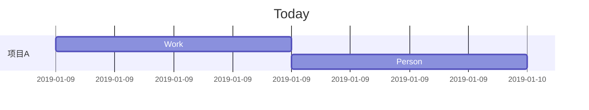

## 2019年1月9日 HZ 多云  风暴-0109

今天重启了一个三月前的项目，代码结构已经发生了非常大的变化，但产品还在坚持要做。

我思考了一下这个项目做的意义
-  完成KPI

这是这个项目唯一的意义。一个三月前的项目为什么拖到现在还没做完？

实际上，三个月前已经做完了，再上线阶段经历了产品变动，新的PM不熟悉之前的业务，所以搁置了。直到现在重启该项目。

我们的工作流程有严重的问题，如果自己经营一家公司，这是绝对不允许的。

还有一件事，我们的架构师擅自修改了一个数据库用户的依赖关系，导致某个数据回调一直出错，在昨天晚上发现。这个问题非常严重，但是被简单的敷衍过去了。

这个问题的复盘如下：

在一个业务中，通过登录用户的session获取到用户的phone来进行业务流程。
该业务的结束依赖于第三方回调，第三方回调的时候，会传递该phone。我们用phone 反向匹配出用户uid。在一个1->1的模型中，是没有问题的。

但是，出现了phone反查不到uid的情况。愿意就是擅自修改数据库导致了信息的变更

该问题暴露除了许多问题。
- phone（user_name） 没有做数据库层的唯一索引
- 擅自修改数据

phone的唯一索引问题是历史债务，系统的初期开发人员对于数据库的创建并没有严格的审查，都是自己想到什么加什么，这些问题再后期慢慢爆发出来，前期的人员多数已经离职，所以就变成了一个永远无法填补的坑。

针对这个问题，需要做数据修复来解决，通过一定量的策略来重新梳理数据库。但是会给线上的业务带来风险。

擅自修改数据，但开发并不知道，这个问题属于组织问题，在一个完善的组织架构中不存在这种擅自修改数据的情况，而且一旦对数据库的数据修改，应该是对开发同步的，显然，在这次事件中并没有发生。

**结论**
在早期设计解决方案的时候就需要具备一定的架构能力，而非开发思维。
组织中的权限一定要严格。

### 编程问题

- Let问题

一个奇怪的bug首先出现在一个app上。大概是这样的：

有个button，在有些版本上不能点击，有些版本上可以点击。

这个button的页面是内嵌的h5页面，h5页面都是同一套，所以要么失败，要么成功。不应该出现有些失败，有些成功的情况。

通过proxy抓包来看，发现没有执行一个js方法，所以基本可以判断是兼容问题。

但是，在抓包的时候，点击的按钮在app内没办法看到console的错误日志，在线上采用alter等调试手段并不可取。
于是，通过代码审查发现，在一个地方的js使用到了let。

let是ES6引入的一个关键词，极有可能是这个东西导致的，修复后发现果然是这个问题。

